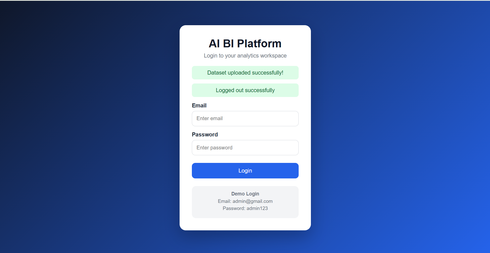
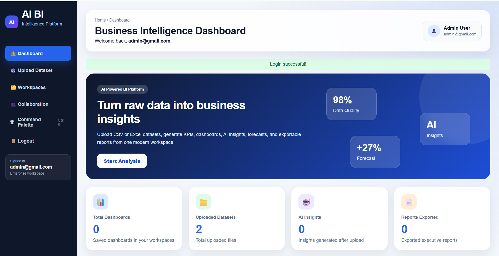
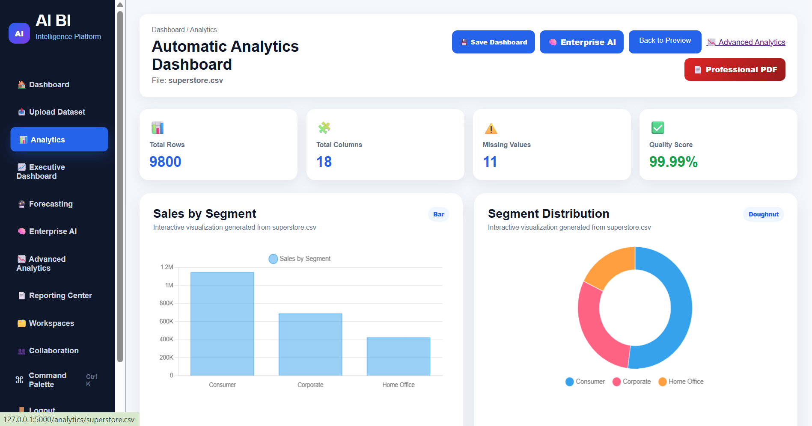
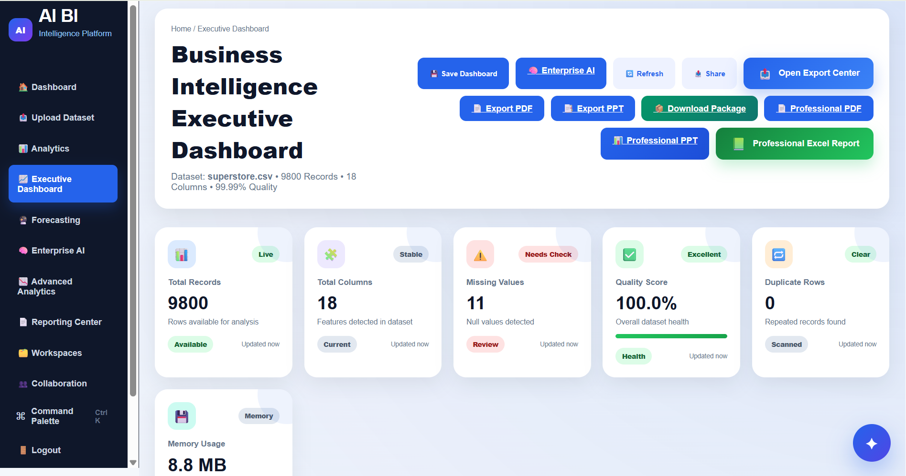
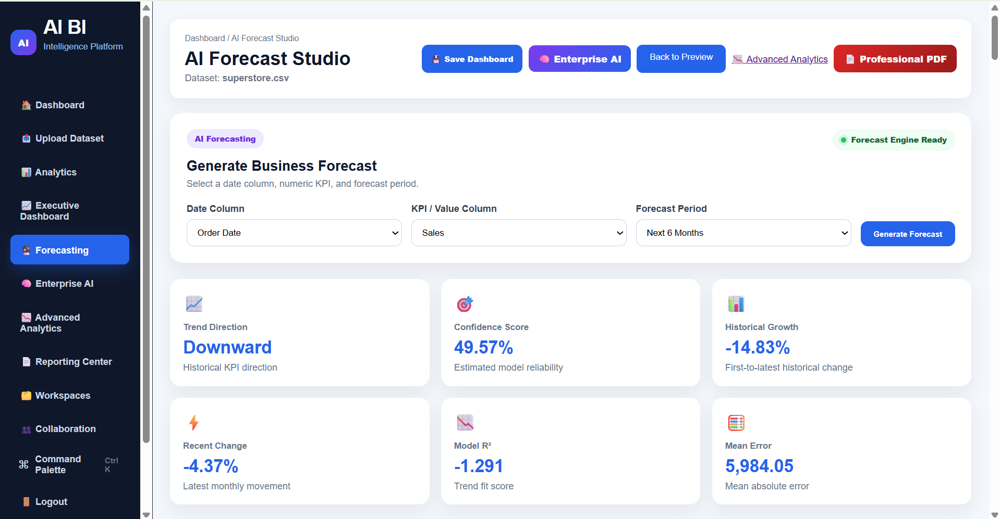
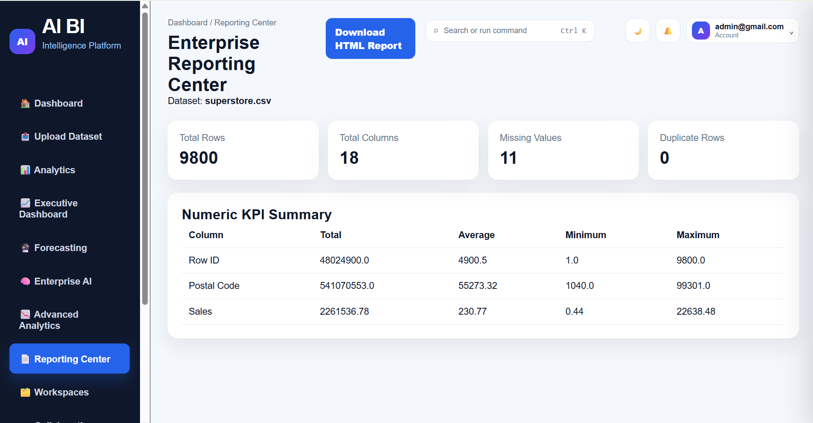
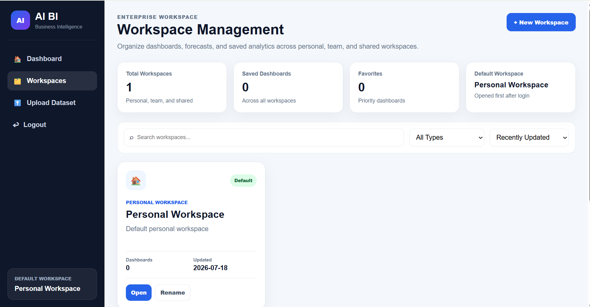
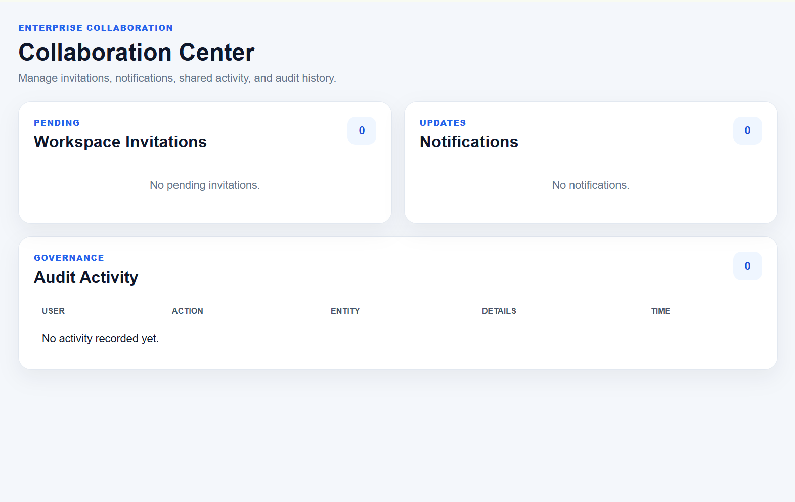

<div align="center">

# 🚀 Enterprise AI Business Intelligence Platform

### AI-Powered Business Intelligence Platform for Automated Analytics, Forecasting, Machine Learning & Executive Reporting

<p align="center">


</p>

<p align="center">


</p>

---

### 📊 Transform Raw Data into Intelligent Business Decisions

Upload any **CSV** or **Excel** dataset and automatically generate:

📈 Interactive Dashboards • 🤖 AI Insights • 📑 Executive Reports • 📊 Forecasts • 🧠 Machine Learning Models • 💼 Business Recommendations

---

</div>

# 🌟 Project Overview

The **Enterprise AI Business Intelligence Platform** is a full-stack AI-powered analytics application developed using **Python**, **Flask**, **Pandas**, **Plotly**, and **Machine Learning**.

The platform enables users to upload datasets, clean and analyze data automatically, generate professional dashboards, forecast future trends, create AI-generated executive reports, and perform advanced business analytics—all from a modern web interface.

Unlike traditional dashboard applications, this platform combines **Business Intelligence**, **Artificial Intelligence**, **Forecasting**, **Machine Learning**, and **Enterprise Workspace Management** into one integrated solution.

---

# ✨ Key Highlights

- 📁 Upload CSV & Excel datasets
- 📊 Interactive Business Dashboards
- 🤖 AI Dashboard Generator
- 🧠 AI Data Assistant
- 💬 AI SQL Assistant
- 📈 Forecasting Studio
- 🤖 AutoML Studio
- 🧠 Machine Learning Studio
- 📊 Advanced Analytics
- 📑 Executive Dashboard
- 💼 Enterprise AI Platform
- 🏢 Workspace Management
- 👥 Collaboration System
- 📄 Professional PDF Reports
- 📽️ PowerPoint Report Generator
- 📊 Excel Export
- ⚡ Performance Cache
- 📈 Business Recommendations
- 📉 Business Risk Analysis
- 🔍 KPI Narration
- 📊 Real-Time Analytics
- 📑 Reporting Center

---

# 🖼️ Application Preview

## 🔐 Login Page

<p align="center">



</p>

---

## 🏠 Dashboard

<p align="center">



</p>

---

## 📊 Analytics Dashboard

<p align="center">



</p>

---

## 📈 Executive Dashboard

<p align="center">



</p>

---

## 🤖 Enterprise AI Platform

<p align="center">


</p>

---

## 🧠 AI Data Assistant

<p align="center">


</p>

---

## 💬 AI SQL Assistant

<p align="center">


</p>

---

## 🤖 AutoML Studio

<p align="center">


</p>

---

## 🧠 Machine Learning Studio

<p align="center">


</p>

---

## 📈 Forecasting Studio

<p align="center">



</p>

---

## 📊 Advanced Analytics

<p align="center">


</p>

---

# 🚀 Core Features

| Module | Description |
|---------|-------------|
| 📂 Dataset Upload | Upload CSV and Excel datasets |
| 🧹 Data Cleaning | Automatic preprocessing and missing-value handling |
| 📊 Analytics Dashboard | Interactive charts and KPI generation |
| 📈 Executive Dashboard | Executive-level insights and summaries |
| 🤖 Enterprise AI | AI-powered business analysis |
| 💬 AI Data Assistant | Conversational dataset exploration |
| 💻 AI SQL Assistant | Natural-language SQL generation |
| 🧠 AutoML Studio | Automated machine learning workflow |
| 📈 Forecasting Studio | Time-series forecasting and trend analysis |
| 📊 Advanced Analytics | Correlation, feature importance, and deep analysis |
| 👥 Collaboration | Shared analytics workspace |
| 🏢 Workspace Management | Organize dashboards and projects |
| 📑 Reporting Center | Centralized report generation |
| 📄 PDF Export | Professional business reports |
| 📽️ PPT Export | Executive PowerPoint presentations |
| 📊 Excel Export | Export processed datasets |

---

# 🛠️ Technology Stack

## Backend

- Python
- Flask
- SQLite
- Pandas
- NumPy
- Scikit-learn

## Frontend

- HTML5
- CSS3
- JavaScript
- Jinja2
- Plotly
- Chart.js

## AI & Analytics

- Machine Learning
- Business Intelligence
- Automated Forecasting
- KPI Narration
- Feature Importance
- Correlation Analysis
- Business Risk Analysis
- AI Recommendation Engine

## Development Tools

- VS Code
- Git
- GitHub
- Render
---

# 🏗️ System Architecture

```text
                        +-----------------------+
                        |     User Browser      |
                        +-----------+-----------+
                                    |
                                    |
                             HTTP Requests
                                    |
                                    ▼
                        +-----------------------+
                        |     Flask Server      |
                        +-----------+-----------+
                                    |
          -------------------------------------------------------
          |             |              |              |           |
          ▼             ▼              ▼              ▼           ▼
 Authentication   Analytics      Enterprise AI   ML Studio   Reporting
          |             |              |              |           |
          ---------------------------------------------------------
                                    |
                                    ▼
                         Business Intelligence Engine
                                    |
      ----------------------------------------------------------------
      |               |               |              |                 |
      ▼               ▼               ▼              ▼                 ▼
 Data Cleaning   Forecasting    AI Insights   AutoML Engine   SQL Assistant
      |               |               |              |                 |
      ----------------------------------------------------------------
                                    |
                                    ▼
                           SQLite Database
                                    |
                                    ▼
                         Export & Reporting Layer
                                    |
                ------------------------------------------
                |                |                       |
                ▼                ▼                       ▼
             PDF Export     PPT Export           Excel Export
```

---

# 📁 Project Structure

```text
Enterprise-AI-Business-Intelligence-Platform
│
├── app.py
├── config.py
├── requirements.txt
│
├── database/
│     └── db.py
│
├── models/
│     └── forecast.py
│
├── routes/
│
│     Authentication
│     ├── auth_routes.py
│
│     Dashboard
│     ├── dashboard_routes.py
│     ├── analytics_routes.py
│     ├── executive_routes.py
│
│     Artificial Intelligence
│     ├── ai_routes.py
│     ├── ai_assistant_routes.py
│     ├── ai_dashboard_builder_routes.py
│     ├── ai_sql_assistant_routes.py
│     ├── enterprise_ai_routes.py
│     ├── enterprise_ai_page_routes.py
│
│     Machine Learning
│     ├── automl_routes.py
│     ├── ml_studio_routes.py
│
│     Forecasting
│     ├── forecast_routes.py
│
│     Enterprise
│     ├── workspace_routes.py
│     ├── workspace_page_routes.py
│     ├── workspace_detail_routes.py
│     ├── collaboration_page_routes.py
│     ├── reporting_center_routes.py
│
│     Advanced Analytics
│     ├── advanced_analytics_routes.py
│     └── advanced_analytics_page_routes.py
│
├── services/
│
│     Core Services
│     ├── data_service.py
│     ├── cleaning_service.py
│     ├── chart_service.py
│     ├── recommendation_service.py
│     ├── insight_service.py
│
│     AI Services
│     ├── enterprise_ai_service.py
│     ├── enterprise_copilot_service.py
│     ├── ai_dashboard_builder_service.py
│     ├── ai_sql_assistant_service.py
│     ├── ai_data_assistant_service.py
│     ├── ai_report_service.py
│
│     Machine Learning
│     ├── automl_service.py
│     ├── ml_studio_service.py
│
│     Forecasting
│     ├── forecast_service.py
│     ├── forecast_model_service.py
│     ├── forecast_explainability_service.py
│     ├── forecasting_studio_service.py
│
│     Business Intelligence
│     ├── executive_summary_service.py
│     ├── business_recommendation_service.py
│     ├── business_risk_service.py
│     ├── realtime_analytics_service.py
│
│     Enterprise Workspace
│     ├── workspace_service.py
│     ├── workspace_version_service.py
│     ├── collaboration_service.py
│     ├── reporting_center_service.py
│
│     Export
│     ├── export_service.py
│     ├── export_history_service.py
│     ├── professional_pdf_service.py
│     ├── professional_ppt_service.py
│     └── professional_excel_service.py
│
├── templates/
├── static/
├── uploads/
├── exports/
├── cache/
├── charts/
├── logs/
├── instance/
└── screenshots/
```

---

# 🧠 Platform Modules

## 📂 Data Processing

- Dataset Upload
- Dataset Preview
- Automatic Data Cleaning
- Missing Value Detection
- Duplicate Detection
- Feature Engineering
- Data Profiling

---

## 📊 Business Intelligence

- KPI Dashboard
- Interactive Charts
- Executive Dashboard
- Advanced Analytics
- Correlation Analysis
- Feature Importance
- Business Recommendations
- Business Risk Analysis

---

## 🤖 Artificial Intelligence

- Enterprise AI Hub
- AI Dashboard Builder
- AI Data Assistant
- AI SQL Assistant
- AI Report Writer
- Enterprise Copilot
- AI Insight Engine

---

## 📈 Forecasting

- Forecast Studio
- Time-Series Forecasting
- Trend Prediction
- Forecast Explainability
- Scenario Analysis

---

## 🧠 Machine Learning

- ML Studio
- AutoML
- Model Training
- Model Evaluation
- Prediction Pipeline

---

## 🏢 Enterprise Features

- Workspace Management
- Workspace Versioning
- Collaboration
- Report Center
- Performance Cache
- Export History

---

## 📑 Professional Reporting

- PDF Reports
- PowerPoint Reports
- Excel Reports
- Executive Report Generator

---

# 🔄 Application Workflow

```text
User Login
      │
      ▼
Dashboard
      │
      ▼
Upload Dataset
      │
      ▼
Data Cleaning
      │
      ▼
Analytics Dashboard
      │
      ├───────────────► Executive Dashboard
      │
      ├───────────────► Enterprise AI
      │
      ├───────────────► AI Dashboard Builder
      │
      ├───────────────► AI SQL Assistant
      │
      ├───────────────► ML Studio
      │
      ├───────────────► AutoML
      │
      ├───────────────► Forecasting Studio
      │
      ├───────────────► Reporting Center
      │
      ├───────────────► Workspace
      │
      ▼
Export Results
      │
      ├────► PDF
      ├────► PPT
      ├────► Excel
      ▼
Business Decision
```

---

# 🎯 Why This Project Stands Out

Unlike traditional dashboard applications, this platform combines multiple enterprise-grade capabilities into a single unified system.

### Key Differentiators

- ✅ End-to-end Business Intelligence workflow
- ✅ Artificial Intelligence-assisted analytics
- ✅ Automated Machine Learning (AutoML)
- ✅ Executive dashboard generation
- ✅ AI-powered report writing
- ✅ Natural-language SQL assistance
- ✅ Time-series forecasting
- ✅ Enterprise workspace management
- ✅ Professional reporting (PDF, PPT, Excel)
- ✅ Modular Flask architecture
- ✅ Scalable service-based design
- ✅ Interactive data visualization

This architecture demonstrates practical experience in **full-stack development**, **data analytics**, **machine learning**, **software architecture**, and **enterprise application design**.
---

# ⚙️ Installation Guide

## Prerequisites

Ensure the following software is installed on your system:

- Python 3.13+
- Git
- VS Code (Recommended)
- pip
- Virtual Environment

---

## Clone Repository

```bash
git clone https://github.com/Aadvik7462/enterprise-ai-business-intelligence-platform.git

cd enterprise-ai-business-intelligence-platform
```

---

## Create Virtual Environment

### Windows

```powershell
python -m venv venv

venv\Scripts\activate
```

### Linux / macOS

```bash
python3 -m venv venv

source venv/bin/activate
```

---

## Install Dependencies

```bash
pip install -r requirements.txt
```

---

## Run the Project

```bash
python app.py
```

Open your browser:

```
http://127.0.0.1:5000
```

---

# 💻 Application Workflow

The platform follows the following intelligent analytics pipeline:

```
Login
   │
   ▼
Upload Dataset
   │
   ▼
Automatic Data Cleaning
   │
   ▼
Analytics Dashboard
   │
   ├────────► Executive Dashboard
   │
   ├────────► Enterprise AI
   │
   ├────────► AI Dashboard Builder
   │
   ├────────► AI Data Assistant
   │
   ├────────► AI SQL Assistant
   │
   ├────────► Forecasting Studio
   │
   ├────────► AutoML Studio
   │
   ├────────► ML Studio
   │
   ├────────► Reporting Center
   │
   ├────────► Collaboration
   │
   └────────► Workspace Management

               │
               ▼

      Professional Reports

      PDF
      PPT
      Excel
```

---

# 📷 More Screenshots

## 📊 Reporting Center

```markdown

```

---

## 🏢 Workspace

```markdown

```

---

## 👥 Collaboration

```markdown

```

---

# 📈 Performance

### Dataset Capacity

✔ Small Dataset

- 1K+ Rows

✔ Medium Dataset

- 10K+ Rows

✔ Large Dataset

- 100K+ Rows

---

### Supported File Formats

- CSV
- XLS
- XLSX

---

### Export Formats

- PDF
- PPT
- Excel
- HTML Reports

---

# 🔒 Security Features

- User Authentication
- Session Management
- Secure File Upload
- Input Validation
- Error Handling
- SQL Injection Protection (parameterized queries where applicable)
- Modular Architecture

---

# 🚀 Future Roadmap

The following enhancements are planned:

- PostgreSQL Integration
- Cloud Storage
- Docker Support
- Kubernetes Deployment
- CI/CD Pipeline
- REST API
- Role-Based Access Control
- OAuth Login
- Live Dashboard Refresh
- AI Chat Assistant using LLM APIs
- Multi-Tenant Workspace
- Real-Time Collaboration
- Email Report Scheduler
- Mobile Responsive Improvements

---

# 🧪 Testing

Before deployment, verify:

- ✅ Login
- ✅ Signup
- ✅ Upload CSV
- ✅ Upload Excel
- ✅ Data Cleaning
- ✅ Analytics Dashboard
- ✅ Executive Dashboard
- ✅ Enterprise AI
- ✅ AI Dashboard Builder
- ✅ AI SQL Assistant
- ✅ AI Data Assistant
- ✅ Forecasting
- ✅ ML Studio
- ✅ AutoML
- ✅ Reporting Center
- ✅ Workspace
- ✅ Collaboration
- ✅ PDF Export
- ✅ PPT Export
- ✅ Excel Export

---

# 📚 Learning Outcomes

This project demonstrates practical experience with:

### Backend

- Flask
- Python
- SQLite
- RESTful Routing
- Service-Based Architecture

### Frontend

- HTML5
- CSS3
- JavaScript
- Jinja2
- Responsive UI

### Data Analytics

- Pandas
- NumPy
- Data Cleaning
- Visualization
- KPI Generation

### Artificial Intelligence

- AI Analytics
- Business Intelligence
- Forecasting
- Recommendation Engine
- AI Report Generation

### Machine Learning

- AutoML
- Feature Engineering
- Prediction Models
- Forecast Models

---

# 📌 Use Cases

This platform can be used in:

- Business Intelligence
- Retail Analytics
- Sales Analytics
- HR Analytics
- Banking Analytics
- Healthcare Analytics
- Manufacturing Analytics
- Supply Chain Analytics
- Marketing Analytics
- Financial Analytics

---

# 👨‍💻 Author

## Aadvik Singh

Electronics & Communication Engineering

Government Engineering College, Jamui

### Connect with Me

- GitHub: https://github.com/Aadvik7462

---

# ⭐ If you like this project

If you found this project helpful:

- ⭐ Star the repository
- 🍴 Fork the repository
- 🛠️ Contribute improvements
- 📢 Share it with others

---

# 📄 License

This project is released for educational and portfolio purposes.

You may use it for learning and personal development.

---

<div align="center">

## 🚀 Enterprise AI Business Intelligence Platform

### Built with ❤️ using Python, Flask, Artificial Intelligence, Machine Learning & Business Intelligence

**Thank you for visiting this repository.**

⭐ Don't forget to Star the Project ⭐

</div>